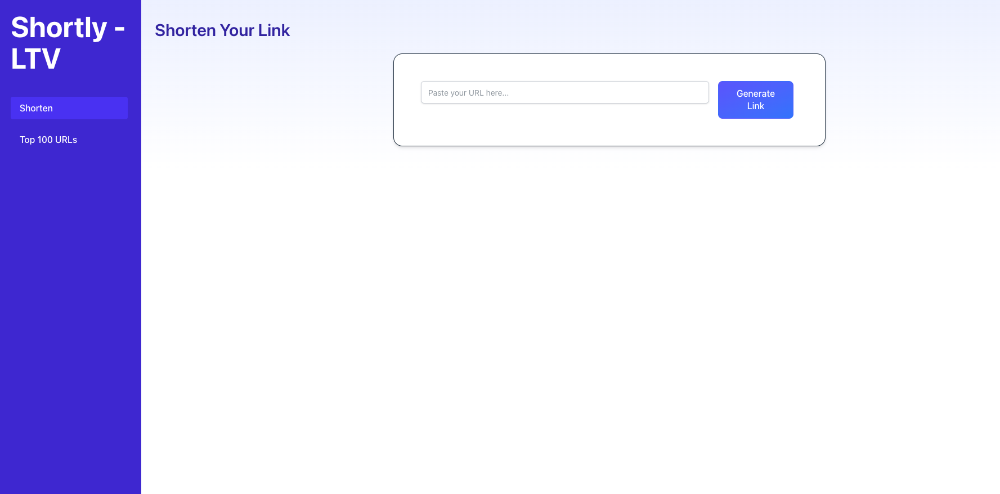
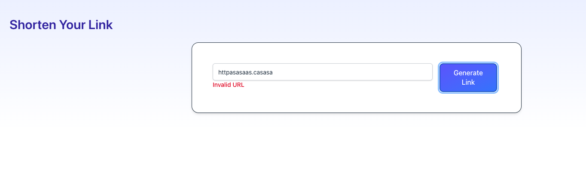
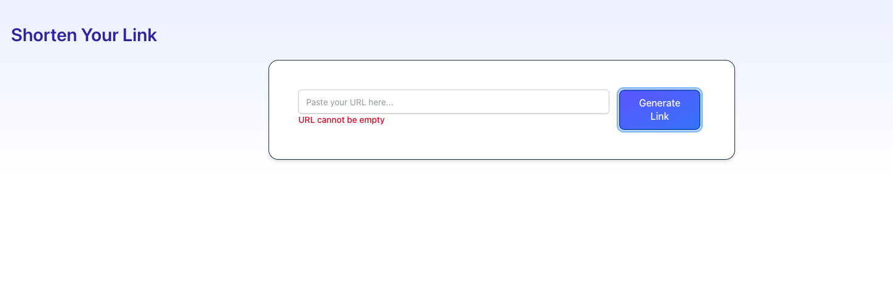
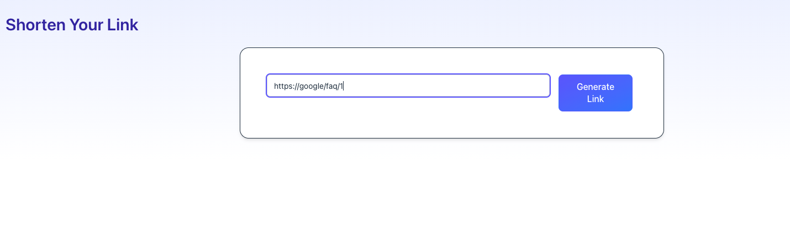
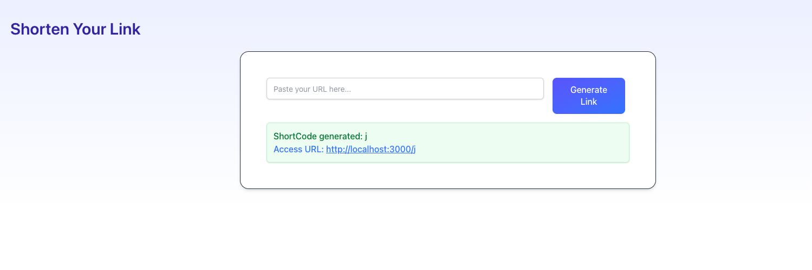
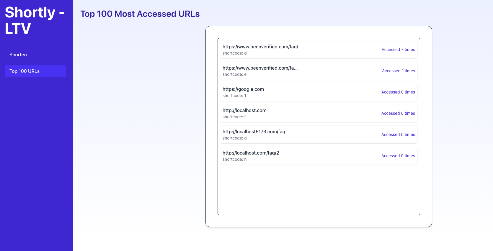

# SantiagoBotina FS Challenge Client
Welcome to the documentation for the client of the API from the first part of the challenge for LTV co.
This project is built with React, TypeScript, and Vite, designed to interact with a Ruby on Rails API backend.

## Preview
### Home

### When URL is invalid

### When URL is empty

### When URL is valid

### Then it's successfully

### Top 100 URLs


## Prerequisites
Ensure you have the following installed:

- Node.js (v18 or higher recommended)

- npm (v9+)

### Clone the repository
```bash
git clone https://github.com/santiagoBotina/santiagobotina-fs-challenge-client.git

cd santiagobotina-fs-challenge-client

npm install
```

### Environment Variables
The .env file is included on the repository as it only contains the API URL and non-sensitive information.

### Start the development server
```bash
npm run dev
```

To access the application, open your browser and navigate to `http://localhost:5173`.

## Testing
The project uses Jest for testing. Test files are located at the same level of the class/file implementation.
To run the tests, use the following command:
```bash
npm run test
```

